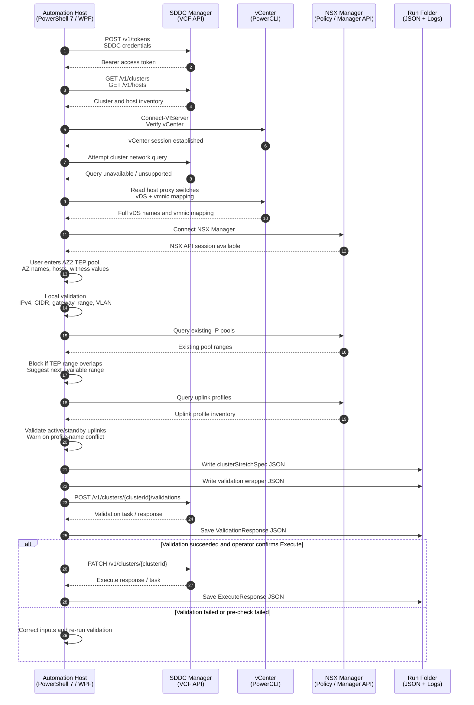

# VCF 9 Stretched Cluster Automation

**Production Version:** v2.0  
**Author:** Michael Molle  
**Runtime:** PowerShell 7+ / WPF  
**Primary Use Case:** Generate, validate, and execute VCF 9 Management Domain stretched-cluster JSON payloads.

---

## Overview

VCF 9 Stretched Cluster Automation is a WPF-based PowerShell tool for preparing and submitting the `clusterStretchSpec` workflow used to stretch a VCF 9 management cluster across AZ1 and AZ2.

The tool connects to:

- **SDDC Manager** for cluster, host, validation, and execution APIs.
- **vCenter** for reliable vDS and vmnic discovery when SDDC Manager network-query APIs are unavailable.
- **NSX Manager** for pre-validation of TEP IP pool overlaps and NSX uplink profile consistency.

Version **2.0** is the production release that consolidates the enhancements developed through the 1.3.x series, including UI cleanup, stronger validation, NSX pre-checks, and safer payload generation.

---

## Key Capabilities

### SDDC Manager integration

- Authenticates to SDDC Manager using `/v1/tokens`.
- Lists VCF clusters.
- Resolves AZ2 host IDs from SDDC Manager inventory.
- Generates the final `clusterStretchSpec` payload.
- Generates a validation wrapper payload.
- Submits validation with:

```text
POST /v1/clusters/{clusterId}/validations
```

- Executes stretch with:

```text
PATCH /v1/clusters/{clusterId}
```

### vCenter integration

- Verifies vCenter connectivity using PowerCLI.
- Uses vCenter host proxy-switch data as the reliable fallback source for:
  - full vDS names,
  - vDS count,
  - host vmnic-to-vDS mapping.

### NSX Manager integration

- Connects to NSX Manager using API credentials.
- Checks AZ2 TEP range against existing NSX IP pool ranges.
- Blocks Generate / Validate / Execute when the requested TEP range overlaps an existing NSX range.
- Suggests the next available range inside the supplied CIDR when possible.
- Queries NSX uplink profiles.
- Validates requested active/standby uplink names against NSX-known uplink names.
- Warns when the generated uplink profile name already exists.
- Warns when the selected VLAN or teaming policy does not appear in extracted NSX uplink profile inventory.

---

## Version 2.0 Change Summary

Version 2.0 includes all production-ready fixes and enhancements from the iterative 1.3.x development cycle.

### Validation and payload safety

- Added client-side IPv4 validation.
- Added CIDR validation.
- Added gateway-in-CIDR validation.
- Added TEP range start/end validation.
- Added range-order validation.
- Added VLAN range validation.
- Added NSX IP pool overlap detection.
- Added suggested available TEP range calculation.
- Added NSX uplink profile validation.
- Added generated uplink profile name conflict warning.
- Removed storage architecture selection because OSA/ESA is not represented in the stretch JSON payload and is inferred by VCF from the selected cluster.

### Network discovery improvements

- Keeps vCenter as the source for vDS/vmnic mapping.
- Handles SDDC Manager network-query API unavailability cleanly.
- Logs fallback detection without alarming 400/404 endpoint noise.
- Preserves full vDS names and refuses unsafe short vDS labels.

### UI and workflow improvements

- Simplified AZ2 Network Profile handling.
- Auto-generates AZ2 Network Profile and uplink profile names.
- Moved advanced NSX/uplink fields into a collapsible Advanced section.
- Removed confusing `isDefault` and name-suffix fields from the main workflow.
- Fixed live UI log pane updates.
- Widened password fields.
- Fixed bottom action-row button clipping.
- Improved Cluster and Detection layout:
  - normal-height cluster dropdown,
  - normal-height Detect Network button,
  - stacked vDS Count, vDS Names, and Uplinks summary panel.

### Operational behavior

- Generate, Validate, and Execute all run pre-checks before building or submitting payloads.
- NSX checks run automatically when NSX Manager is connected.
- If NSX Manager is not connected, the workflow logs a warning but does not block.
- All outputs are written to a timestamped run folder.

---

## Generated Files

Each run creates a timestamped output folder such as:

```text
VCFStretch-Run-yyyyMMdd-HHmmss
```

Typical output files include:

```text
VCFStretch-yyyyMMdd-HHmmss.log
DetectedNetworkRaw_<clusterId>_<timestamp>.json
clusterStretchSpec_<clusterId>_<timestamp>.json
clusterUpdateSpec_validationWrapper_<clusterId>_<timestamp>.json
ValidationResponse_<clusterId>_<timestamp>.json
ExecuteResponse_<clusterId>_<timestamp>.json
```

---

## End-to-End Workflow



---

## Prerequisites

### Workstation

- Windows workstation or management VM.
- PowerShell 7+.
- .NET/WPF support.
- Network reachability to:
  - SDDC Manager,
  - vCenter,
  - NSX Manager,
  - witness appliance,
  - AZ2 ESXi hosts.

### PowerShell modules

Recommended modules:

```powershell
VMware.PowerCLI
VCF.PowerCLI
ImportExcel
```

The UI includes buttons to install or re-check common prerequisites.

### VCF / SDDC prerequisites

- Target cluster selected in SDDC Manager.
- AZ2 hosts commissioned and visible in SDDC Manager.
- Witness appliance deployed and reachable.
- Witness FQDN, vSAN IP, and vSAN CIDR known.
- AZ2 NSX TEP VLAN, CIDR, gateway, and range planned.
- NSX TEP range confirmed not to overlap existing pools.

---

## How to Run

Launch from PowerShell 7:

```powershell
pwsh.exe -ExecutionPolicy Bypass -File .\VCF9-StretchCluster-Automation-v2.0.ps1
```

Recommended workflow:

1. Click **Recheck** in Prerequisites.
2. Enter SDDC Manager FQDN and credentials.
3. Click **Connect SDDC**.
4. Select the target cluster.
5. Enter vCenter FQDN and credentials.
6. Click **Verify vCenter**.
7. Enter NSX Manager FQDN and credentials.
8. Click **Connect NSX**.
9. Click **Detect Network**.
10. Fill AZ2 TEP pool values.
11. Fill AZ1/AZ2 names, AZ2 hosts, and witness details.
12. Expand Advanced only if you need to override generated uplink values.
13. Click **Generate JSON**.
14. Click **Validate**.
15. Review validation output.
16. Click **Execute** only during the approved change window.

---

## Main UI Sections

### Prerequisites

Displays PowerShell and module status.

### Connections

Collects connection details for:

- SDDC Manager,
- vCenter,
- NSX Manager.

Passwords are not saved in configuration files.

### Cluster and Detection

Contains:

- Cluster selector.
- Detect Network button.
- Stacked detection summary:
  - vDS Count,
  - vDS Names,
  - Uplinks.

### AZ2 NSX TEP Pool

Collects:

- pool name,
- CIDR,
- gateway,
- range start,
- range end,
- transport VLAN.

### Advanced Generated Names / Uplink Profile

Contains generated and override-capable fields:

- generated AZ2 network profile,
- uplink profile,
- teaming policy,
- active uplinks,
- standby uplinks,
- vDS-to-NSX uplink mapping.

Most users should not need to modify these unless NSX validation reports a mismatch.

### Stretch Inputs

Collects:

- AZ1 name,
- AZ2 name,
- AZ2 host FQDNs,
- witness FQDN,
- witness vSAN IP,
- witness vSAN CIDR,
- license and Edge multi-AZ options.

---

## Validation Behavior

Before JSON generation, validation, or execution, the script performs:

1. Required field checks.
2. IPv4/CIDR validation.
3. Gateway-in-CIDR validation.
4. TEP range-in-CIDR validation.
5. TEP start/end order validation.
6. VLAN validation.
7. NSX IP pool overlap validation.
8. NSX uplink profile validation.
9. Host ID resolution through SDDC Manager.
10. vDS consistency checks based on detected vCenter data.

If NSX Manager is connected, NSX checks are enforced. If NSX Manager is not connected, the script logs a warning and continues with local and SDDC Manager validation.

---

## Troubleshooting

### NSX IP overlap failure

Example:

```text
Requested TEP range 10.52.56.200-10.52.56.210 overlaps existing NSX range(s):
10.52.56.194-10.52.56.201, 10.52.56.202-10.52.56.205.
Suggested available range: 10.52.56.206-10.52.56.216.
```

Correct the range and re-run Generate or Validate.

### NSX uplink mismatch

If validation reports that `uplink1` or `uplink2` is not found in NSX-known uplink names, expand Advanced and adjust:

```text
Active Uplinks
vDS -> NSX Map
```

Common alternatives include:

```text
uplink-1,uplink-2
```

or:

```text
uplink1,uplink2
```

Use the naming convention reported by NSX validation.

### Network query unavailable

This is expected in some environments. The script uses vCenter PowerCLI fallback for vDS and vmnic discovery.

### UI log is empty

Version 2.0 includes dispatcher-safe live log updates. If the UI log does not update, check the run folder log file.

---

## Security Notes

- SDDC Manager bearer tokens are held in memory only.
- Passwords are not saved in configuration files.
- Generated JSON and API responses may contain environment-specific infrastructure data.
- Store run folders securely.
- Review payloads before Execute.

---

## License

Internal use. Provide attribution if reused or modified.
